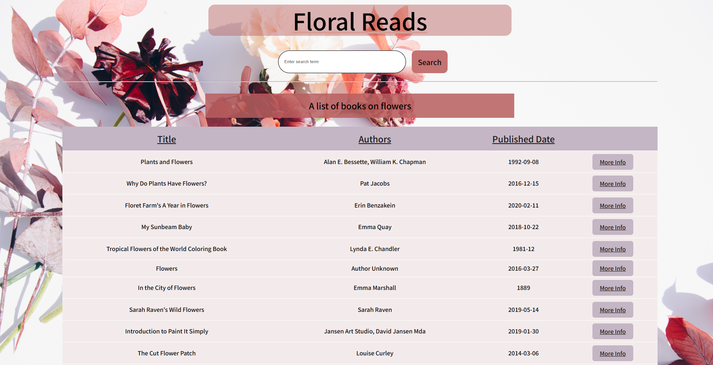
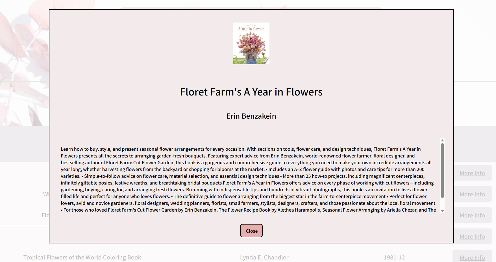

## GoogleBooks-Flowers

- link

---

## Requirements / Purpose

- MVP

- Fetch and display a list of books related to flowers from the following REST API: https://www.googleapis.com/books/v1/volumes?q=flowers
- Present the fetched data in a table, including book title, authors, and published date.
- Enable users to view more details of a selected book, such as title, subtitle, authors, image, and description.
- Encourage the candidates to showcase their creativity and add a personal touch to the application.
- Include a README file explaining the app's features and the creative elements introduced.

## Build Steps

- npm install
- npm run dev

---

## Features

- Single page react application with a header, search form and table to display the search results.

- The main purpose of the app is to display flower related books so a floral background and colors were used to match the theme. 

- The main page of the application consists of a table that fetches and displays a list of books related to flowers from the following REST API: https://www.googleapis.com/books/v1/volumes?q=flowers by default. If an error occurs while fetching data, the user will see a message indicating that an error has occurred, rather than the application appearing to do nothing. 

- The data is presented in a table which includes the book title, authors, and published date. The fetched data in some cases have missing information. For example the author or published date may be missing. App handles the missing data by displaying error messages to let the user know that the information is not available. 
- The table headings are clickable and provides sorting functionality. Books can be sorted by title, author and published date. By default the sort order is ascending. The sort order alternates between ascending and descending with each click.

- The 'More Info' button enables users to view more details. Clicking on the button opens a modal which displays the details of the selected books. Image, title author and description of the books are displayed in the modal. A default image source is used for books with missing image links. If the book's title or author(s) are missing, an empty tag is rendered. This ensures that the layout of the book details remains consistent regardless of whether all the details are present or not.The close button is provided to close the modal and return to the main page. 

- In case the user wants to search for books on specific flowers or any other details, the app has a book search form. Book search form enables user to enter search queries and displays the fetched results in the table. In case of search returning no results, a message is displayed to let the user know that no books were found for the particular search.

---

## Known issues

- The fetched data has missing values for some of the fields and this results in errors while sorting the data. Currently the app displays missing fields with "Author unknown" or "Date not found". Sort feature needs to be fixed to take into account the missing data fields in the fetched data while sorting the results.
- Testing has not been implemented for all the features. 

---

## Future Goals

- Implement data cleaning to fix errors in sorting.
- Improve the sort function to take into account the results with missing data. 
- Add more tests to ensure robust performance

---

## What did you struggle with?

- The challenging part of this project was writing tests for each component because of lack of experience in this area.

---

# Technology

- React
- React Testing Library
- Typescript
- SCSS
